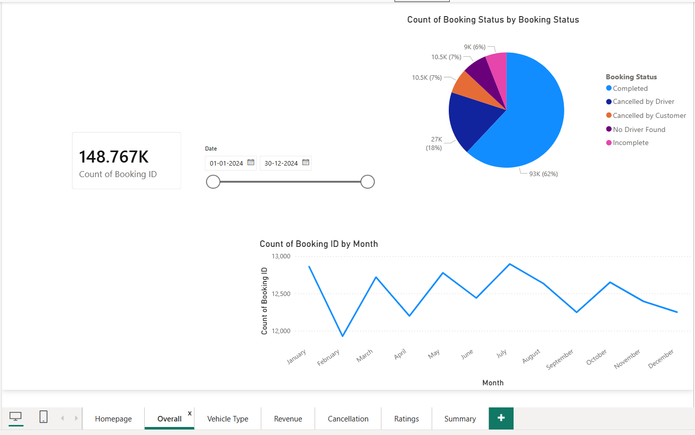
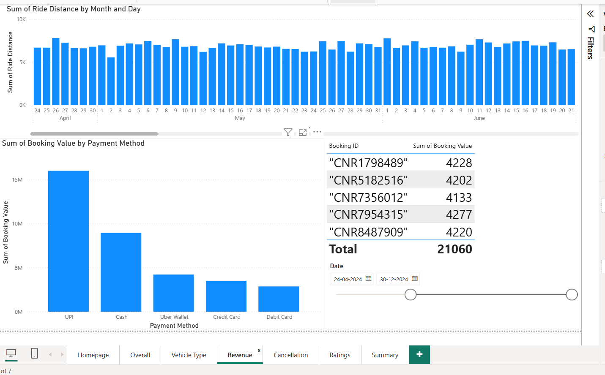
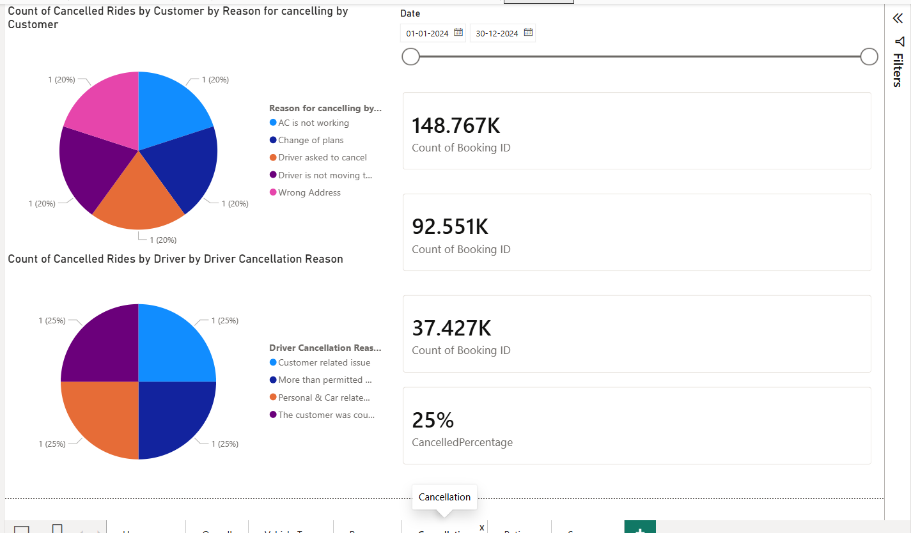

# 🚖 Ride Booking Analytics Dashboard | Power BI

## 📌 Project Overview

The **Ride Booking Analytics Dashboard** is a comprehensive Business Intelligence solution developed using **Power BI** to analyze and monitor ride-booking operations. The project leverages a dataset containing **150,000+ ride booking records** to uncover valuable insights related to revenue, customer behavior, driver performance, vehicle utilization, and ride cancellations.

This dashboard transforms raw operational data into meaningful visual insights, helping stakeholders make informed business decisions and improve overall service efficiency.

---

## 🎯 Project Objectives

* Analyze ride booking trends and patterns.
* Monitor overall revenue and booking performance.
* Evaluate customer and driver satisfaction levels.
* Identify major cancellation reasons affecting operations.
* Compare performance across different vehicle categories.
* Enable data-driven decision-making through interactive reporting.

---

## 🛠️ Tools & Technologies Used

* Power BI
* Power Query
* DAX (Data Analysis Expressions)
* Data Modeling
* Data Visualization
* Microsoft Excel
* Business Intelligence Techniques

---

## 📂 Dataset Information

The dataset contains ride booking information including:

* Booking ID
* Customer Information
* Driver Information
* Vehicle Type
* Booking Status
* Ride Distance
* Booking Value
* Customer Ratings
* Driver Ratings
* Payment Method
* Cancellation Reasons

**Total Records Analyzed:** 150,000+

---

## 📊 Dashboard Highlights

### Executive KPIs

* Total Bookings
* Completed Rides
* Total Revenue Generated
* Customer Ratings
* Driver Ratings
* Booking Success Rate

### Revenue Analysis

* Total Booking Value
* Revenue Contribution by Vehicle Category
* Revenue Trends & Performance Analysis

### Customer Insights

* Customer Rating Distribution
* Booking Preferences
* Payment Method Analysis

### Driver Performance

* Driver Rating Analysis
* Driver Cancellation Patterns
* Performance Monitoring Metrics

### Vehicle Analysis

* Vehicle-wise Booking Distribution
* Revenue by Vehicle Category
* Ride Completion Comparison

### Cancellation Analysis

* Customer Cancellation Reasons
* Driver Cancellation Reasons
* Incomplete Ride Analysis
* No Driver Available Cases

---

## 📈 Key Insights

✅ Analyzed over **150,000 ride bookings**

✅ Identified top-performing vehicle categories

✅ Evaluated ride completion and cancellation patterns

✅ Assessed customer and driver satisfaction metrics

✅ Measured revenue contribution across different services

✅ Developed an interactive dashboard for operational monitoring

---

# 📷 Dashboard Preview

## 🏠 Overview Dashboard

<p align="center">
  
</p>

---

## 💰 Revenue Analysis Dashboard

<p align="center">
  
</p>

---

## ❌ Cancellation Analysis Dashboard

<p align="center">
  
</p>

---

## 🚀 Business Impact

This dashboard helps organizations:

* Improve operational efficiency
* Reduce ride cancellation rates
* Enhance customer experience
* Monitor driver performance
* Optimize revenue generation
* Support strategic business decisions

---

## 📁 Repository Contents

```text
Ride-Booking-Analytics-Dashboard/
│
├── README.md
├── Ride.pbix
├── yt.pbix
├── rideBookings.csv
├── overview.png
├── revenue.png
└── cancellation.png
```

---

## ▶️ How to Use

1. Download the repository.
2. Open the `.pbix` file using Microsoft Power BI Desktop.
3. Refresh the dataset if required.
4. Explore the interactive dashboards and insights.

---

## 👨‍💻 Author

### Raja Rahul Kumar

**Data Analyst | Power BI Developer | AI & Machine Learning Enthusiast**

🔗 LinkedIn: https://www.linkedin.com/in/raja-rahul-kumar-9a150725b/

🔗 GitHub: https://github.com/Rajarahulkr

---

## ⭐ Support

If you found this project useful, consider giving it a **Star ⭐** on GitHub.

Your support helps showcase the project and encourages future development.
